# cracked-glass

Deterministic cracked / shattered glass effect for the web. The whole effect is a **pure
function of time**: `(t, seed, params) -> styles`. No clocks, no `Math.random`, no CSS/SMIL/WAAPI
animations, no WebGL, no network, no mutable state between calls — built for frame-by-frame
capture engines (headless Chromium) where render is called with arbitrary `t` in any order and
the same `t` must produce pixel-identical output.

```bash
npm install cracked-glass
```

Four fracture modes (`title` — broken headline, `radial` — impact web with a punched-out
center, `collapse` — diagonal mesh crumbling out of its frame, `hero` — free shards levitating
over content), two media (`content` — the content itself breaks; `glass` — a glass pane over
anchored content, shards become moving lenses), two renderers (HTML clone tier for arbitrary
content, single-`<svg>` premium tier for headlines with true per-channel chromatic
decomposition), micro-debris, edge bevels with conchoidal light scatter, corner relief, outlier
shards, edge-refraction rims and spectral flares — all driven by one `t` prop.

## Showcase

Headline cracking, breaking apart and the static broken preset (`mode: 'title'`):

| crack propagation | broken (one piece dropped, others slipped) | shatter |
|---|---|---|
| 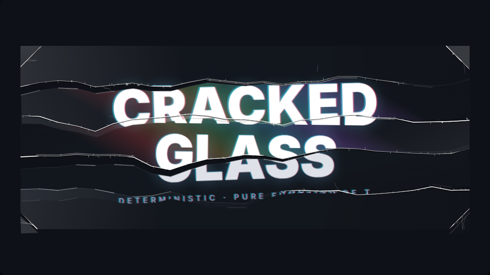 | 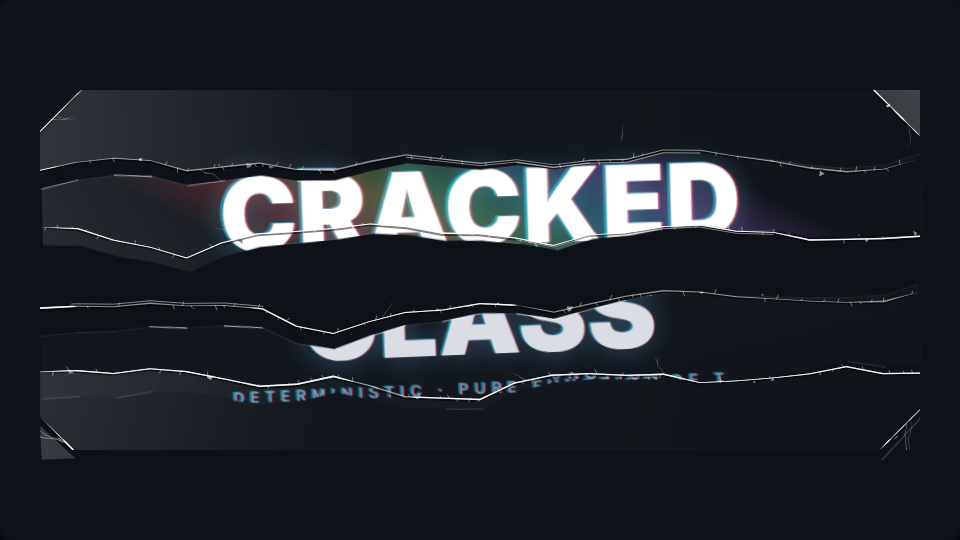 | 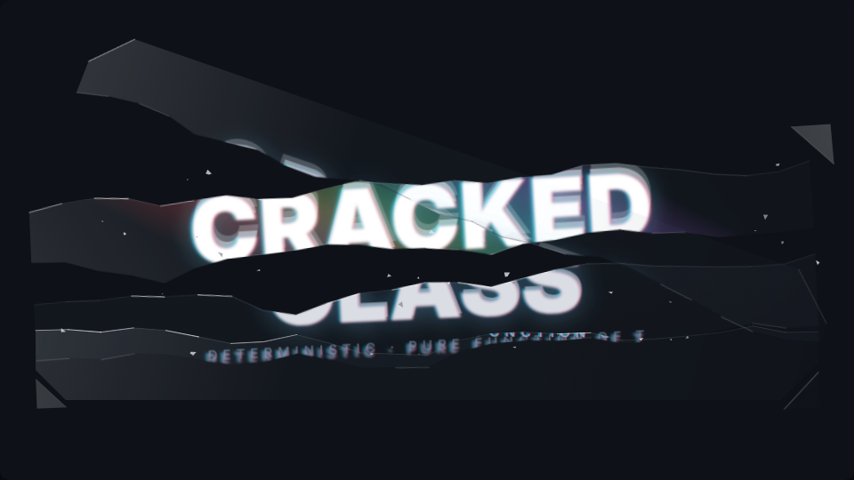 |

Screen transition with a punched-out impact center (`mode: 'radial'`):

| impact web, partial rings | shards part, edges catch light | mid-flight with content smear |
|---|---|---|
| 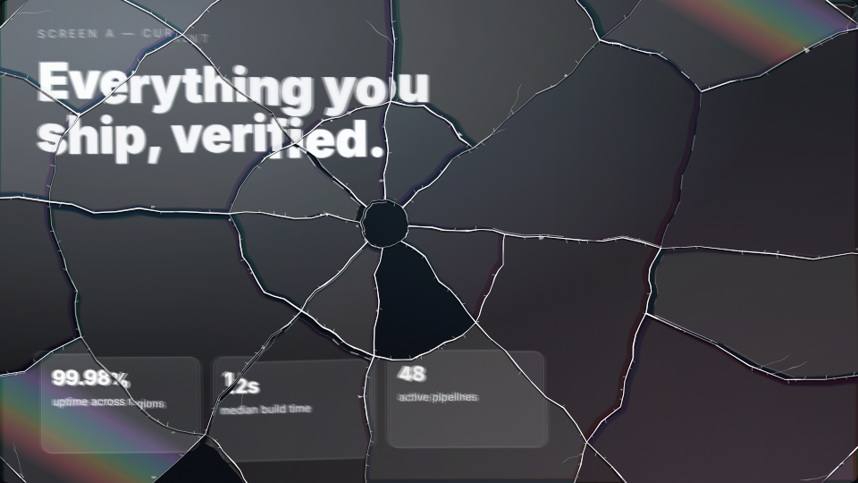 | 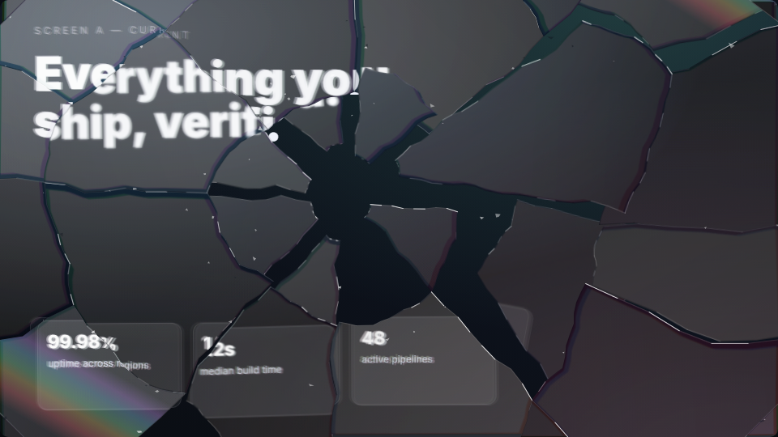 | 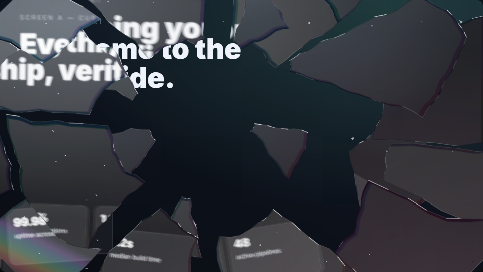 |

Diagonal mesh crumbling out of its frame (`mode: 'collapse'`):

| cracked mesh with a spectral flare | bottom rows tear off | crumble |
|---|---|---|
| 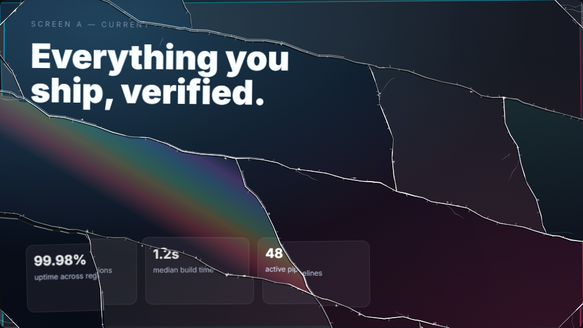 | 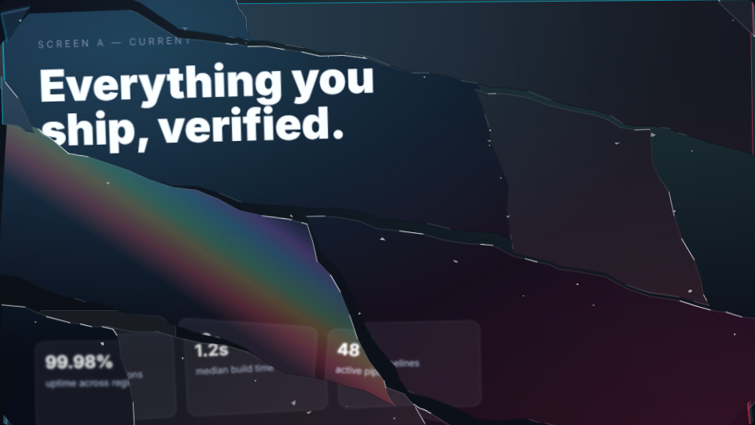 | 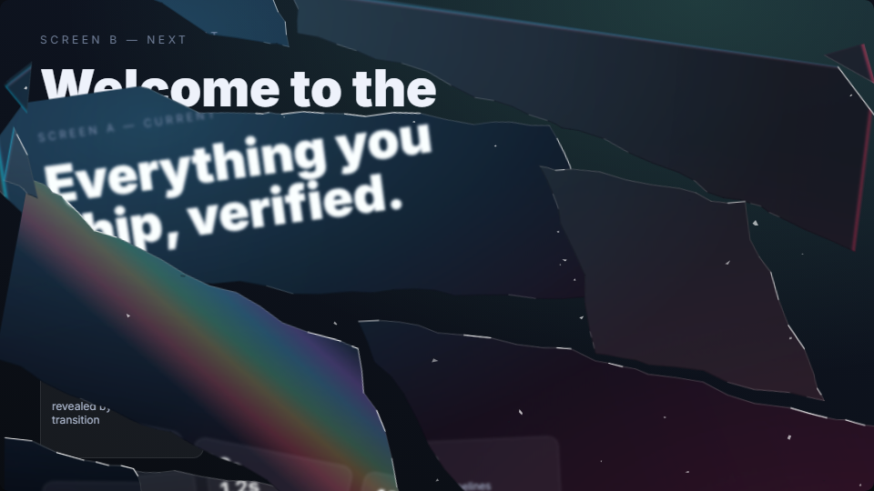 |

SVG premium text tier — true `feColorMatrix` channel decomposition (`<CrackedGlassText/>`):

| channel split | broken | shatter |
|---|---|---|
| 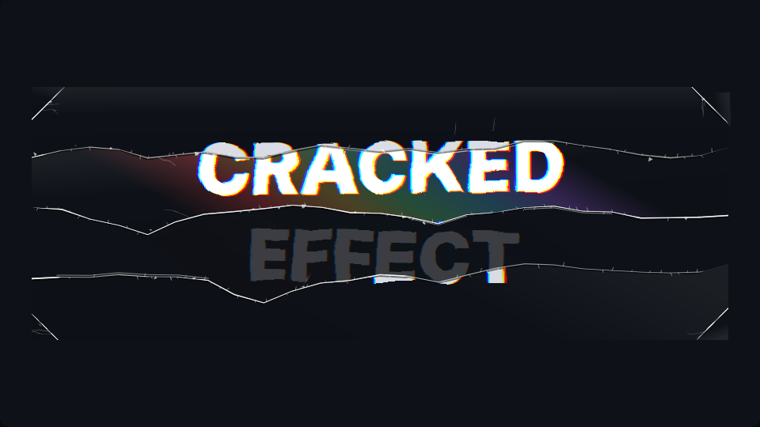 | 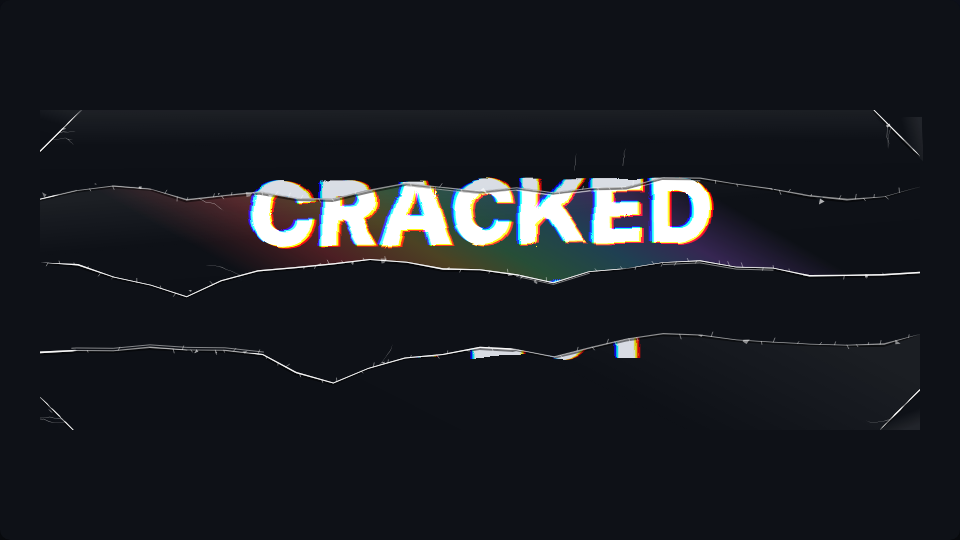 | 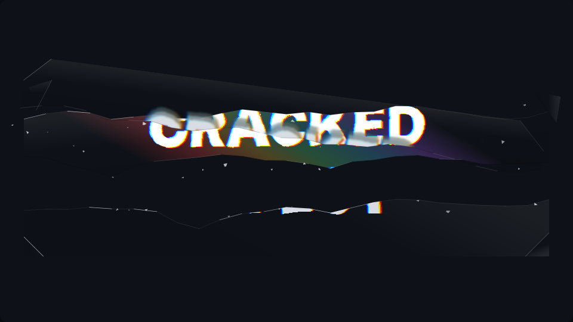 |

A shard levitating over content as a moving lens — the page stays put, only the refraction
travels (`mode: 'hero'`, `medium: 'glass'`):

| glass lens over the page | edge close-up: prism rim + spectral flare |
|---|---|
| 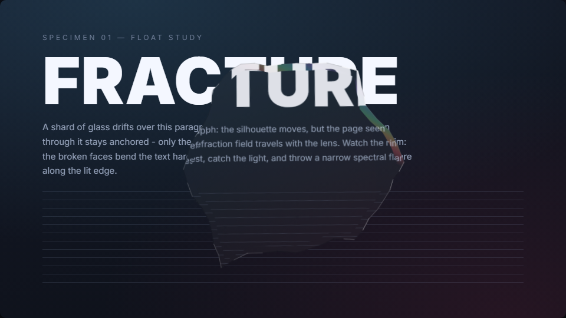 | 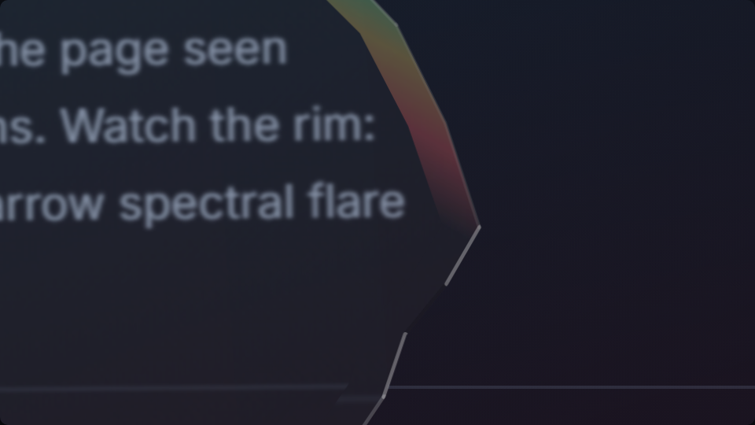 |

```
generateFracture(opts)        -> FracturePattern   // t-independent geometry, frozen, cacheable
computeFrame(t, pattern, fx)  -> FrameData         // plain numbers + ready-to-assign style strings
<CrackedGlass t pattern fx>   // React, HTML clone tier (any content)
<CrackedGlassText t pattern>  // React, SVG premium tier (headlines)
```

```tsx
import { generateFracture, staticCrackedTimeline } from 'cracked-glass';
import { CrackedGlass } from 'cracked-glass/react';

const pattern = generateFracture({ mode: 'title', width: 880, height: 360, seed: 7 });

// inside your engine-driven component; t comes in as a prop, 0..1
<CrackedGlass t={t} pattern={pattern} fx={{ timeline: staticCrackedTimeline }}>
  <h1>CRACKED GLASS</h1>
</CrackedGlass>
```

---

## 1. The optics of broken glass (what we reproduce and how)

Each shard is a thin glass plate, slightly tilted and displaced out of plane. Seven phenomena
make the look:

| Physics | What you see | Web technique used here |
|---|---|---|
| Plate tilt → double refraction at entry/exit faces | Lateral image shift ∝ thickness × tilt, slight perspective/scale change | per-shard `translate/scale/rotate` + `perspective() rotateX/rotateY(≤2°)` on the content clone |
| Conchoidal fracture faces | Jagged edges with VOLUME: variable crack thickness, taper at the growing tip, stretches where the second face catches light | midpoint-displacement polylines rendered as variable-width filled RIBBONS (fbm width profile over arc length) + offset dark face ribbon (multiply) + parallel double-edge filaments + hackle ticks |
| Glass thickness at shard edges | Bright/dark bevel rims; tumbling shards glint as edges sweep past the light | per-shard url()-free SVG layer: polygon edges bucketed into 12 static normal-angle sectors, per-frame opacity = f(sector angle + spin − light); flies inside the shard's clip |
| Crack network is never tidy | A minority of cracks veer hard off the main flow | seeded excursion/kink events (`deviation` param): corridor-clamped bumps in title/collapse lines, budget-shared angular kinks in radial rays |
| Dispersion n(λ) | Chromatic fringes along the displacement direction, strongest near edges | HTML tier: two colored `drop-shadow()` silhouettes (zero extra DOM) or hue-rotated screen-blended clones; SVG tier: true `feColorMatrix` channel split + `feOffset` + screen merge |
| Fresnel reflection grows with incidence angle | Tilted facets catch white sheen or darken | brightness/contrast from `dot(facetNormal, lightDir)`; facet layer: white→black `linear-gradient` at the facet angle with configurable blend/opacity/tint |
| Fracture hierarchy: radial cracks first, concentric later; crushing at impact | "Bullseye": bright impact spot, rays, then arcs | polar crack grid; per-polyline birth times; impact sparkle gradient |
| Cracks accelerate and BIFURCATE (mirror→mist→hackle); later cracks die into earlier ones | Forked cracks, T-junctions, highly uneven fragment sizes; concentric rings are PARTIAL arcs, never circles | tilted non-parallel band boundaries + up to 3 stratified diagonal splitters per band (`bands.tilt/splitters`); partial rings with radial cell merging (`rings.partial`); mesh-separator merging (`collapse.merge`) |
| Partial-depth lateral cracks / hackle traces | Many short dead-end hairlines running from main cracks INTO shard interiors | render-only stub cracks (`stubs`, `crackStyle.subCracks`): tapered thin ribbons branching at 20-55°, occasionally forking, born as the parent tip passes; never touch shard geometry |
| Conchoidal fracture face = micro-facets at scattered angles | A SINGLE broken edge shows interleaved highlight AND shadow segments; cracks are blinding-bright in stretches and nearly invisible in others | static specular/shaded edge split with scatter-biased lighting (`bevel.scatter`); per-crack bright/dim arc ranges with a dim underlay (`crackStyle.brightnessVar`) |
| Impact punches clean through | A real hole at the impact: the crush plug is knocked out as cracks form, backdrop shows through | radial crush disc (sized by `impactHole`, min(w,h)-invariant) fades/shrinks/sinks as a pure function of crackProgress (`fx.crush.punch`); the impact sparkle dies with it |
| Fracture is never tidy: system + exceptions | A minority of shards disobey - one falls out whole, one sits visibly slipped, one flies off-script | hash-classified outliers (`fx.outliers`): dropped (fade out of the cracked state, capped at the expected count), slipped (rigid offset+rotation, outward for radial / gravity-wise otherwise), rebel (early/late, off-axis, faster); small patterns are guaranteed >= 1 exception |
| Dispersion catches the light on a facet | A faint rainbow streak on the 1-2 shards best aligned with the light source | `fx.spectrum`: light-axis gradient band sized to the shard's own extent, selection by pose-vs-light alignment (t-independent), glints deterministically as the shard turns |
| Micro debris and glass dust | Glitter, mood, motion that follows the break pattern | tiny SVG polygons with ballistic kinematics (outward for radial, falling for title/collapse) + deterministic twinkle |
| The pane cracks instantly; what moves is the glass over the content | Crisp shard edges, motion-smeared content inside | content-smear copies inside the shard clip (exact kinematics resampled at τ−kΔ, rotated into the wrapper frame) + speed-scaled content blur; whole-shard ghost trails are off by default |

## 2. Feasibility verdicts (the research questions)

| Target | Without WebGL | Verdict |
|---|---|---|
| **Text** | Full palette. Two renderers: HTML clone tier and SVG `<text>` tier with true channel decomposition and `feDisplacementMap` refraction, all inside ONE `<svg>` (headless-safe by construction) | ✅ yes, incl. premium |
| **Container with arbitrary HTML** | Clone content once per shard + url()-free `clip-path: polygon()` + transforms. Cost = DOM weight × shard count → quality caps; feed an `` snapshot for heavy scenes. Stateful children (inputs/video) break when cloned — clones get `aria-hidden` | ✅ yes, with caps |
| **Live backdrop under the container** | `backdrop-filter` cannot displace the backdrop (transforms move sampling and painting together); `backdrop-filter: url(#fe...)` is Chromium-only, flaky, and violates the same-svg rule. Remaining: per-shard blur/brightness/saturate + facets + crack overlay — no refraction of the backdrop | ⚠️ partial (degraded mode, post-MVP; API reserves the slot) |
| **WebGL** | Max physics fidelity and determinism are possible (shader of uniform `t`), but content must be a texture — arbitrary live DOM cannot be captured, and capture engines avoid the GPU lane | ❌ not used; the geometry core is reusable if ever needed |

## 3. True-mathematical shards (no SVG presets)

All geometry is generated from `(seed, params)`. Three modes:

- **radial**: a polar grid. Radius grid `r[ray][ring]` from cumulative positive jittered
  increments normalized to land exactly on R (beyond the farthest corner) — rings are monotone
  and never invert, the outer band always covers the rect, then cells are clipped to it
  (Sutherland–Hodgman). "Ray doubling": secondary rays deterministically start at ring 2, so
  outer bands split twice as fine with no planar-graph topology extraction. A "crush zone" disc
  replaces degenerate wedge tips at the impact. Ray waviness amplitude scales with `r·Δθ`,
  so converging rays cannot cross.
- **title**: a stack of wavy near-horizontal boundaries (fbm on y, clamped under half the band
  gap — bands cannot cross) + optional near-vertical diagonal splitters. `deviation` adds
  corridor-clamped excursions: cracks veer hard, then shear back along the flow.
- **collapse**: two transversal families of wavy lines (default 14° / 76°, ≥35° apart) form an
  irregular diagonal quad mesh. Intersections are computed on SMOOTH base lines whose tangent
  cones are disjoint by construction (slope clamp `tan(min(16°, (Δ−20°)/2))` + per-family
  corridor clamp) → any A-line crosses any B-line **exactly once**; each intersection is one
  shared point, conchoidal jag is applied per slice afterwards → watertight bit-for-bit.
  Pieces then lose support bottom-up (row-indexed stagger + strong random admixture) and
  crumble out of the frame under gravity (`collapseShatterPreset`).
- Every crack polyline is generated **once** and shared by both adjacent shards → watertight
  by construction (no gaps, no overlaps; verified by area-conservation and shared-vertex tests).
- Conchoidal jagging: midpoint displacement seeded from `hash(seed, edgeId)` — order-independent.
- PRNG: mulberry32 with independent streams per subsystem (`hash(seed, subsystem, index)`), so
  consuming randomness in one feature never shifts another.
- Flight: closed-form ballistics with drag `p(τ) = v0·(1−e^(−dτ))/d + g·(dτ−1+e^(−dτ))/d²`,
  spin/tumble `θ = ω·τ`, per-ring stagger. Motion-blur ghosts re-evaluate the same formulas at
  `τ − kΔ`. Fully scrub-safe: no integration, no state.

## Determinism contract (encoded as tests)

- `computeFrame` is referentially transparent: byte-identical `FrameData` for identical
  `(t, pattern, fx)` in any call order (`test/determinism.test.ts`).
- A single number formatter (`fmt`) emits fixed precision, strips `-0`, never exponent notation.
- Constant DOM structure for every `t` (no element popping between frames).
- z-order fixed at generation; never re-sorted by `t`.
- No DOM measurement: `width`/`height` are explicit options.
- `instanceId` is seed-derived (no module-level counters). Two same-seed instances on one page
  need distinct `instanceId`s.
- Forbidden-API scan of `src/` (`test/forbidden-apis.test.ts`): no timers, no `Date.now`,
  no `performance.*`, no `Math.random`, no fetch/storage, no CSS/WAAPI/SMIL animations.
- Same-svg rule (`test/svg-refs.test.tsx`): every `url(#id)`/`href="#id"` resolves inside its
  own `<svg>`; HTML-tier shard styles are 100% url()-free (clip-path polygons + filter functions).
- On-stack verification: `npm run capture:check` screenshots a t-list in two orders and across
  a page reload — every same-t pair must be byte-identical PNG. Run your capture engine with the
  deterministic Chromium flags this repo uses: `--disable-gpu --use-angle=swiftshader
  --disable-lcd-text --force-color-profile=srgb --num-raster-threads=1 --disable-partial-raster`
  (threaded/partial rasterization makes pixels depend on tile scheduling and visit history).

## API sketch

```ts
generateFracture({
  mode: 'title' | 'radial' | 'collapse',
  width, height, seed,            // required, px (the library never measures the DOM)
  edgeDetail?: 0|1|2|3,           // conchoidal subdivision depth
  jaggedness?: number,            // 0..1
  deviation?: number,             // 0..1 veering cracks (default 0.35)
  seamOutsetPx?: number,          // antialiasing-seam hiding outset (default 0.4)
  micro?: { count?, sizeRange? } | false,
  stubs?: { maxPerCrack?, atJunctions? } | false,        // dead-end hairlines (render-only)
  bands?: { count?, waviness?, diagonalChance?, tilt?, splitters? },   // title
  impact?, impactHole?, rays?: { count?, doubling?, ... },
  rings?: { count?, spacing?, jitter?, partial? },       // radial (partial arcs!)
  collapse?: { angleA?, angleB?, countA?, countB?, waviness?, merge? },
}): FracturePattern

computeFrame(t, pattern, fx?: DeepPartial<EffectParams>): FrameData
// fx: quality ('draft'|'normal'|'high' or explicit settings), timeline {crackStart, crackEnd,
// shatterStart}, refraction {offsetPx, rotateDeg, scaleAmp, tiltDeg, perspectivePx},
// optics {brightnessAmp, contrastAmp, blurPx, lightAngleDeg}, chroma {mode: 'shadow'|'ghost'|
// 'none', offsetPx, angleDeg, colors...}, facet {strength, tint, opacity, blendMode},
// crackStyle {coreColor, coreWidth, shadowColor, shadowOffsetPx, widthVariance, doubleEdge,
// subCracks, brightnessVar, hackleDensity, sparkle, blendMode}, bevel {widthPx, intensity,
// glintStrength, lightColor, darkColor, blendMode, scatter}, crush {punch, scaleTo}, outliers {dropFraction, slipFraction,
// rebelFraction, slipPx, slipRotDeg}, spectrum {count, opacity, bandWidth, blendMode},
// shatter {speed, gravity, drag, spinDegMax, tumbleDegMax, staggerPerRing, jitter,
// fadeOut}, motionBlur {dt, opacityFalloff, speedThreshold, smearPx, smearBlurPx}, micro, settle

staticCrackedTimeline  // { crackStart: -1, crackEnd: 0, shatterStart: Infinity } - broken title
collapseShatterPreset  // gravity-dominant crumble overrides for mode 'collapse'
```

React (`cracked-glass/react`): `<CrackedGlass t pattern fx>{children}</CrackedGlass>`,
`<CrackedGlassText t pattern fx text={['CRACKED','EFFECT']} />`, `useCrackedGlassFrame(t, pattern, fx)`.
Time arrives only via the `t` prop; the components have no effects, no state, no ids from `useId`.

## Performance knobs

Measured per captured frame (element screenshot + SwiftShader software raster with the
deterministic flags incl. single raster thread, 960×540; the ~100 ms screenshot overhead is
included — pure `computeFrame` is < 4 ms):

| scene | draft | normal | high |
|---|---|---|---|
| title (HTML tier) | 190 ms | 214 ms | 243 ms |
| radial transition | 276 ms | 524 ms | 630 ms |
| collapse transition | 351 ms | 566 ms | 588 ms |
| text (SVG tier) | 113 ms | 115 ms | 118 ms |

Quality presets map to: chroma ghost clones (0/2/2), content-smear copies (0/2/3), edge bevel
(off/on/on), whole-shard ghosts (0/0/0 — explicit opt-in), max blur px (0/2/4), grain
(off/off/on), micro-shard cap (40/140/400). The heavy path is documented: radial/collapse over
heavy DOM multiplies content clones (1 + chroma ghosts + smear copies per shard) — feed the
transition an `` snapshot of the screen, or use `draft`.

## Known limitations

- Spectral-flare shard selection depends on `fx.optics.lightAngleDeg` and `fx.spectrum.count`:
  animating those params re-picks the carrier shards and pops DOM (animating `t` never does).
- Under 'screen' blending the rainbow band is invisible over pure-white content (screen with
  white is white) - expected glass-flare physics; it reads in darker regions of the shard.
- `FracturePattern.version` is 5: corner relief is on by default (a diagonal chord lops the
  90-degree shard off each canvas corner), so partition patterns regenerate differently than
  v4 for the same seed. Pass `corners: false` for the pre-relief geometry.
- Jagged rim (a slightly oversized slab with a broken perimeter) is not in 0.5 — it needs an
  enlarged render viewBox and generator-level shared-perimeter jagging; tracked for 0.6.
- `medium: 'glass'` is screen-space: each shard refracts only the underlying content; shards
  never see each other (no neighbor reflections, no compounded refraction where lenses overlap,
  no cast shadows). 3D rigid tumble is disabled in glass (a clipped wrapper flattens transforms).
- Backdrop ("content under the container") mode ships degraded by physics: no backdrop
  displacement without WebGL (see verdict table). Planned as a separate `target` once needed.
- SVG text tier: SVG `<text>` only (no HTML wrapping), 2D-only shard motion.
- Whole-shard opacity < ~0.97 in the pre-shatter phase re-exposes antialiasing seams between
  shards (the "glass transparency" knob is the facet layer, not shard opacity).
- Two same-seed instances mounted simultaneously need distinct `instanceId`s.

## Creative guide

How to *play* this instrument — mood-to-parameter recipes, pacing curves, light direction,
seed casting — lives in [docs/AGENT-GUIDE.md](docs/AGENT-GUIDE.md) (written for AI agents
building motion-design systems, useful for humans too).

## Lab (interactive sandbox)

[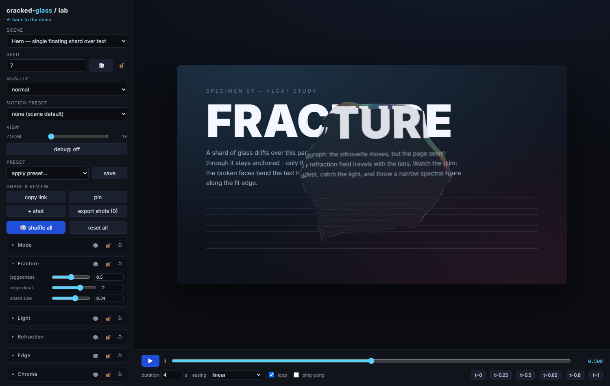](https://kossik.github.io/cracked-glass/lab.html)

Tune the effect in the browser: every `fx` knob and fracture option as a live control, scene
presets, randomizers, `t` playback with easings, pin-and-compare, and shareable URLs. Find a
look, then read the state off the controls (or a shared link) into your code.

- **Play now:** **https://kossik.github.io/cracked-glass/lab.html**
- **Locally:** `npm run dev` → open `/lab.html`.
- Full tour: [docs/LAB.md](docs/LAB.md).

## License

[MIT](LICENSE).

## Repository scripts

- `npm run dev` — demo + [Lab](docs/LAB.md): manual t-scrubber (no clocks), scene presets, every
  knob, playback, pin-and-compare, seam-inspection zoom, perf HUD.
- `npm test` — vitest suite: determinism, geometry/fracture invariants, forbidden APIs, same-svg.
- `npm run build` — `tsc` → `dist/` (ESM + d.ts).
- `npm run capture:check` — byte-identical screenshot determinism on a real Chromium.
- `npm run capture:measure` — the perf table above.
- `npm run lab:preview` / `npm run lab:smoke` — Lab scene screenshots / interaction smoke test.

The Lab is auto-deployed to GitHub Pages on every push to `master`
([.github/workflows/deploy.yml](.github/workflows/deploy.yml)).
